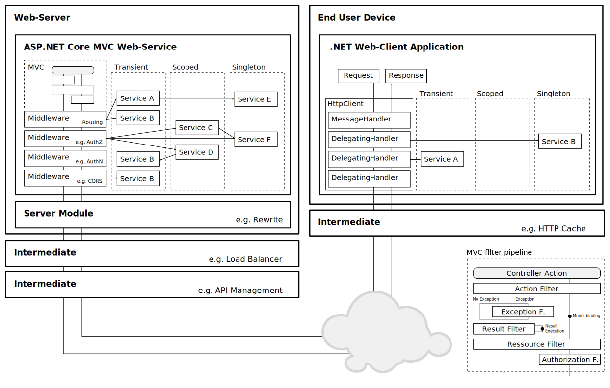
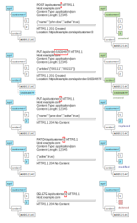

# ASP.NET Core

Demo Code with Examples for educational purpose

# Overview

# Web Service Characteristics
  - Loose coupling
  - Dynamic binding
  - Utilization of (open) standards
  - Deployment
  - Shifts importance of Software Architects
  - Higher invest in comparison to the usage of libraries
  - Higher complexity in comparison to the usage of libraries
    - Availability
    - Security
    - Versioing
    - Performance

# HTTP

[Protocol Specifications](https://developer.mozilla.org/en-US/docs/Web/HTTP/Resources_and_specifications)

## Verbs

Method                                                                   | Semantics | [Safe](https://www.w3.org/Protocols/rfc2616/rfc2616-sec9.html#sec9.1.1) | [Idempotent](https://www.w3.org/Protocols/rfc2616/rfc2616-sec9.html#sec9.1.2) | 
------------------------------------------------------------------------ | --------- | ----------------------------------------------------------------------- | ----------------------------------------------------------------------------- | 
[OPTIONS](https://www.w3.org/Protocols/rfc2616/rfc2616-sec9.html#sec9.2) |           | True                                                                    | True                                                                          | 
[HEAD](https://www.w3.org/Protocols/rfc2616/rfc2616-sec9.html#sec9.4)    | Read      | True                                                                    | True                                                                          | 
[GET](https://www.w3.org/Protocols/rfc2616/rfc2616-sec9.html#sec9.3)     | Read      | True                                                                    | True                                                                          | 
[PUT](https://www.w3.org/Protocols/rfc2616/rfc2616-sec9.html#sec9.6)     | Upsert    | False                                                                   | True                                                                          | 
[POST](https://www.w3.org/Protocols/rfc2616/rfc2616-sec9.html#sec9.5)    | Create    | False                                                                   | False                                                                         | 
[PATCH](https://tools.ietf.org/html/rfc5789)                             | Update    | False                                                                   | False                                                                         | 
[DELETE](https://www.w3.org/Protocols/rfc2616/rfc2616-sec9.html#sec9.7)  | Delete    | False                                                                   | True                                                                          | 

Remarks:
- Idempotence
  - Cares about the state; doesn't require the response of a repeated operation to be identical

Examples:

Further readings:
- [Using HTTP Methods for RESTful Services](http://www.restapitutorial.com/lessons/httpmethods.html)

## Status Codes
- Overview
- [HTTP 1.1 - Sec. 10](https://www.w3.org/Protocols/rfc2616/rfc2616-sec10.html)
- Most important
- Success
    - [200 OK](https://developer.mozilla.org/en-US/docs/Web/HTTP/Status/200)
    - [201 Created](https://developer.mozilla.org/en-US/docs/Web/HTTP/Status/201)
    - [202 Accepted](https://developer.mozilla.org/en-US/docs/Web/HTTP/Status/202)
    - [204 No Content](https://developer.mozilla.org/en-US/docs/Web/HTTP/Status/204)
- Redirect
    - [302 Found](https://developer.mozilla.org/en-US/docs/Web/HTTP/Status/302)
- Client Side Error
    - [400 Bad Request](https://developer.mozilla.org/en-US/docs/Web/HTTP/Status/400)
    - [401 Unauthorized](https://developer.mozilla.org/en-US/docs/Web/HTTP/Status/401)
    - [403 Forbidden](https://developer.mozilla.org/en-US/docs/Web/HTTP/Status/403)
    - [404 Not Found](https://developer.mozilla.org/en-US/docs/Web/HTTP/Status/404)
    - [405 Method Not Allowed](https://developer.mozilla.org/en-US/docs/Web/HTTP/Status/405)
    - [406 Not Acceptable](https://developer.mozilla.org/en-US/docs/Web/HTTP/Status/406)
    - [409 Conflict](https://developer.mozilla.org/en-US/docs/Web/HTTP/Status/409)
    - [415 Unsupported Media Type](https://developer.mozilla.org/en-US/docs/Web/HTTP/Status/415)
- Server Side Error
    - [500 Internal Server Error](https://developer.mozilla.org/en-US/docs/Web/HTTP/Status/500)
    - [503 Service Unavailable](https://developer.mozilla.org/en-US/docs/Web/HTTP/Status/503)

Further readings:
- [Redirections](https://developer.mozilla.org/en-US/docs/Web/HTTP/Redirections)

## Header

- Connection Management
  - Response/Request
    - [Connection](https://developer.mozilla.org/en-US/docs/Web/HTTP/Connection)
    - [Keep-Alive](https://developer.mozilla.org/en-US/docs/Web/HTTP/Headers/Keep-Alive)
  - *Note*: In HTTP/2 connection management is handled by other mechanisms
- Congestion Control
  - Response
    - [Retry-After](https://developer.mozilla.org/en-US/docs/Web/HTTP/Headers/Retry-After)
- Warning
  - Response
    - [Warning](https://developer.mozilla.org/en-US/docs/Web/HTTP/Warning)
- Discovery
  - Response
    - [Allow](https://developer.mozilla.org/en-US/docs/Web/HTTP/Allow)
- Content Modification
  - Request
    - [Content-Type](https://developer.mozilla.org/en-US/docs/Web/HTTP/Content-Type)
    - [Content-Length](https://developer.mozilla.org/en-US/docs/Web/HTTP/Content-Length)
  - Response
    - [Location](https://developer.mozilla.org/en-US/docs/Web/HTTP/Location)
- [Authentication](https://developer.mozilla.org/en-US/docs/Web/HTTP/Authentication)
  - Request
    - [Authorization](https://developer.mozilla.org/en-US/docs/Web/HTTP/Authorization)
    - [Proxy-Authorization](https://developer.mozilla.org/en-US/docs/Web/HTTP/Proxy-Authorization)
  - Response
    - [WWW-Authenticate](https://developer.mozilla.org/en-US/docs/Web/HTTP/WWW-Authenticate)
    - [Proxy-Authenticate](https://developer.mozilla.org/en-US/docs/Web/HTTP/Proxy-Authenticate)
- [Conditional Requests](https://developer.mozilla.org/en-US/docs/Web/HTTP/Conditional_requests)
  - Strong Validation
    - Request
      - [If-Match](https://developer.mozilla.org/en-US/docs/Web/HTTP/If-Match)
      - [If-None-Match](https://developer.mozilla.org/en-US/docs/Web/HTTP/If-None-Match)
  - Weak Validation
    - Request
      - [If-Modified-Since](https://developer.mozilla.org/en-US/docs/Web/HTTP/If-Modified-Since)
      - [If-Unmodified-Since](https://developer.mozilla.org/en-US/docs/Web/HTTP/If-Unmodified-Since)
      - [If-Range](https://developer.mozilla.org/en-US/docs/Web/HTTP/If-Range)
- [Content Negotiation](https://developer.mozilla.org/en-US/docs/Web/HTTP/Content_negotiation)
  - Content Type
    - Request
      - [Accept](https://developer.mozilla.org/en-US/docs/Web/HTTP/Accept)
      - [Accept-Charset](https://developer.mozilla.org/en-US/docs/Web/HTTP/Accept-Charset)
    - Response
      - [Content-Type](https://developer.mozilla.org/en-US/docs/Web/HTTP/Content-Type)
  - Language
    - Request
      - [Accept-Language](https://developer.mozilla.org/en-US/docs/Web/HTTP/Accept-Language)
    - Response
      - [Content-Language](https://developer.mozilla.org/en-US/docs/Web/HTTP/Content-Language)
  - Client Hints
    - Request
      - [User-Agent](https://developer.mozilla.org/en-US/docs/Web/HTTP/Headers/User-Agent)
      - [Device-Memory](https://developer.mozilla.org/en-US/docs/Web/HTTP/Device-Memory)
      - [DPR](https://developer.mozilla.org/en-US/docs/Web/HTTP/DPR)
      - [Viewport-Width](https://developer.mozilla.org/en-US/docs/Web/HTTP/Viewport-Width)
      - [Width](https://developer.mozilla.org/en-US/docs/Web/HTTP/Width)
- [Caching](https://developer.mozilla.org/en-US/docs/Web/HTTP/Caching)
  - Request/Response
    - [Cache-Control](https://developer.mozilla.org/en-US/docs/Web/HTTP/Cache-Control)
  - Response
    - [Age](https://developer.mozilla.org/en-US/docs/Web/HTTP/Age)
    - [ETag](https://developer.mozilla.org/en-US/docs/Web/HTTP/ETag)
    - [Vary](https://developer.mozilla.org/en-US/docs/Web/HTTP/Vary)
    - [Last-Modified](https://developer.mozilla.org/en-US/docs/Web/HTTP/Last-Modified)
    - [Expires](https://developer.mozilla.org/en-US/docs/Web/HTTP/Headers/Expires)
- [Compression](https://developer.mozilla.org/en-US/docs/Web/HTTP/Compression)
  - Request
    - [Accept-Encoding](https://developer.mozilla.org/en-US/docs/Web/HTTP/Accept-Encoding)
  - Response
    - [Content-Encoding](https://developer.mozilla.org/en-US/docs/Web/HTTP/Content-Encoding)
- [Cookies](https://developer.mozilla.org/en-US/docs/Web/HTTP/Cookies)
  - Request
    - [Set-Cookie](https://developer.mozilla.org/en-US/docs/Web/HTTP/Set-Cookie)
  - Response
    - [Cookie](https://developer.mozilla.org/en-US/docs/Web/HTTP/Cookie)
- [Byte Range Request](https://developer.mozilla.org/en-US/docs/Web/HTTP/Range_requests)
  - Request
    - [Accept-Ranges](https://developer.mozilla.org/en-US/docs/Web/HTTP/Headers/Accept-Ranges)
  - Response
    - [Content-Range](https://developer.mozilla.org/en-US/docs/Web/HTTP/Headers/Content-Range)
- [Cross Origin Resource Sharing (CORS)](https://www.w3.org/TR/cors/)
  - Request
    - [Origin](https://developer.mozilla.org/en-US/docs/Web/HTTP/Headers/Origin)
  - Response
    - [Access-Control-Allow-Credentials](https://developer.mozilla.org/en-US/docs/Web/HTTP/Access-Control-Allow-Credentials)
    - [Access-Control-Allow-Headers](https://developer.mozilla.org/en-US/docs/Web/HTTP/Access-Control-Allow-Headers)
    - [Access-Control-Allow-Methods](https://developer.mozilla.org/en-US/docs/Web/HTTP/Access-Control-Allow-Methods)
    - [Access-Control-Allow-Origin](https://developer.mozilla.org/en-US/docs/Web/HTTP/Access-Control-Allow-Origin)
    - [Access-Control-Expose-Headers](https://developer.mozilla.org/en-US/docs/Web/HTTP/Access-Control-Expose-Headers)
    - [Access-Control-Max-Age](https://developer.mozilla.org/en-US/docs/Web/HTTP/Access-Control-Max-Age)
    - [Access-Control-Request-Headers](https://developer.mozilla.org/en-US/docs/Web/HTTP/Access-Control-Request-Headers)
    - [Access-Control-Request-Method](https://developer.mozilla.org/en-US/docs/Web/HTTP/Access-Control-Request-Method)
- [Content Security Policy (CSP)](https://developer.mozilla.org/en-US/docs/Web/HTTP/CSP)
  - Response
    - [Content-Security-Policy](https://developer.mozilla.org/en-US/docs/Web/HTTP/Headers/Content-Security-Policy)
- [HTTP Strict Transport Security (HSTS)](https://tools.ietf.org/html/rfc6797)
  - Response
    - Strict-Transport-Security
- Tracking
  - Request
    - [Referer](https://developer.mozilla.org/en-US/docs/Web/HTTP/Headers/Referer)
    - [DNT](https://developer.mozilla.org/en-US/docs/Web/HTTP/Headers/DNT)
  - Response
    - [Referrer-Policy](https://developer.mozilla.org/en-US/docs/Web/HTTP/Headers/Referrer-Policy)
    - [Tk](https://developer.mozilla.org/en-US/docs/Web/HTTP/Headers/Tk)
    - [Via](https://developer.mozilla.org/en-US/docs/Web/HTTP/Via)

## Media Types

In alphabetical order:
- [Atom](https://tools.ietf.org/html/rfc4287)
  - `application/atom+xml`
- Form Data
  - multipart/form-data
- [HTML](https://www.w3.org/TR/html52/)
  - `text/html`
- [iCalendar](https://tools.ietf.org/html/rfc5545)
  - `text/calendar`
- [JSON](http://www.ecma-international.org/publications/files/ECMA-ST/ECMA-404.pdf)
  - `application/json`
- [Protobuf](https://github.com/protocolbuffers/protobuf)
  - *not registered*
  - Currently in use
    - `application/x-protobuf`
    - `application/vnd.google.protobuf`
- Text
  - `text/plain`
- [XML](https://www.w3.org/TR/xml/)
  - `application/xml`
- [YAML](http://yaml.org/spec/1.2/spec.html)
  - *not registered*
  - Currently in use
    - `text/x-yaml`
    - `application/x-yaml`
    - `application/yaml`
    - `application/vnd.yaml`

Further readings:
- [Multipurpose Internet Mail Extensions(MIME)](https://www.ietf.org/rfc/rfc2045.txt)
- [Media Types](https://www.iana.org/assignments/media-types/media-types.xml)
- [MIME types](https://developer.mozilla.org/en-US/docs/Web/HTTP/Basics_of_HTTP/MIME_types)
- [Incomplete list of MIME types](https://developer.mozilla.org/en-US/docs/Web/HTTP/Basics_of_HTTP/MIME_types/Complete_list_of_MIME_types)

## Comparison to SOAP

- [SOAP 1.2](https://www.w3.org/TR/soap12-part0/) has been standardized by W3C in April 2007
- SOAP is considered RPC while REST relies on manipulation of addressable ressources
- SOAP works without HTTP but is usually used on top, since communication via HTTP is usually enabled in a corporate security infrastructure
- Some HTTP Features are redundant to remove a dependencie to HTTP
- Tooling for HTTP cannot be used
    - Only used verb is POST
      - No HTTP Caching
    - Informations in body
      - No URL based filtering
- SOAP has a defined set of associated standards ([WS-*](https://msdn.microsoft.com/en-us/library/ms951274.aspx)), created by a few organizations

# REST

## Architectural Style

- Acronym for `Representational State Transfer`
- Dissertation of Roy Fielding (2000): [Architectural Styles and the Design of Network-based Software Architectures](https://www.ics.uci.edu/~fielding/pubs/dissertation/rest_arch_style.htm)
- RESTfulness of an architecture is defined by constraints
  - [Client-Server](https://www.ics.uci.edu/~fielding/pubs/dissertation/rest_arch_style.htm#sec_5_1_2)
  - [Stateless](https://www.ics.uci.edu/~fielding/pubs/dissertation/rest_arch_style.htm#sec_5_1_3)
  - [Cache](https://www.ics.uci.edu/~fielding/pubs/dissertation/rest_arch_style.htm#sec_5_1_4)
  - [Uniform Interface](https://www.ics.uci.edu/~fielding/pubs/dissertation/rest_arch_style.htm#sec_5_1_5)
    - [Identification of resources](https://www.ics.uci.edu/~fielding/pubs/dissertation/rest_arch_style.htm#sec_5_2_1_1)
    - [Manipulation of resources through representations](https://www.ics.uci.edu/~fielding/pubs/dissertation/rest_arch_style.htm#sec_5_2_1_2)
    - [Self-descriptive messages](https://www.ics.uci.edu/~fielding/pubs/dissertation/rest_arch_style.htm#sec_5_3_1)
      - Interaction is stateless between requests
      - Standard methods used
      - Media types are used to indicate semantics and exchange information
      - Responses explicitly indicate cacheability
    - Hypermedia as the engine of application state
  - [Layered System](https://www.ics.uci.edu/~fielding/pubs/dissertation/rest_arch_style.htm#sec_5_1_6)
  - [Code-On-Demand](https://www.ics.uci.edu/~fielding/pubs/dissertation/rest_arch_style.htm#sec_5_1_7) (optional)
- See also [REST APIs must be hypertext-driven](https://roy.gbiv.com/untangled/2008/rest-apis-must-be-hypertext-driven)

## Classficiation

- [Original dissertation](https://www.ics.uci.edu/~fielding/pubs/dissertation/rest_arch_style.htm#sec_5_1_8)
- [Richardson Maturity Model](https://martinfowler.com/articles/richardsonMaturityModel.html)

# API Design

## Terminology

- Endpoint
- Hyperlink
- Intermediary
- Link Relation
- Resource
- Resource Collection
- Resource Identification

## Aspects

### Universal

- Naming conventions
- Type conventions
  - Representation of date and time (points, durations & intervals)
- API Discovery and Description
  - Hyperlinking
    - Locator representation
      - Templating
    - Relation semantics
  - Allowed actions
    - Supporting actions that don't fit in the semantic corset of standard verbs
  - Providing meta information
  - Document structure
- Retrieval of a single resource
  - Partial resource retrieval
  - Representation of relationships
  - inclusion of related resources
- Manipulation of single resources
  - Updating resources
  - Partially updating resources
  - Adding relationships
  - Removing relationships
- Retrieval of resource collections
  - Filtering
  - Sorting
  - Pagination
- Mainpulation of resource collections
  - Adding/Upserting resources
    - Generation of identifiers
      - Client-side
      - Server-side
    - Polymorphy
      - Type declaration
  - Removing resources
    - Tombstoning
    - Trash Bin
- Searching
- Representation of error information
  - Status Codes
  - Document structure
- Change Management
  - Undo
  - Delta queries
- Events
- Batch requests
- Resilience
  - Retrying requests
- Security
  - Authentication
  - Authorization
- API Lifecycle
  - Compatibility
    - Versioning
  - Deprecation
- Cachability
- Internationalisierung
- Asynchronicity
  - Long running operations
    - Initiation
    - Status retrieval
    - Cancellation
- Availability
  - Throttling
  - Rate Limiting
- Consistency
  - Optimistic concurrency control
    - Conflict avoidance
    - Conflict detection
    - Conflict handling
  - Transactions
- Multitenancy
  - Measuring
  - Monetization
- Developer experience
  - Documentation
  - Tooling
  - Code on Demand

### [Microservices](https://martinfowler.com/articles/microservices.html)

- [Componentization via Services](https://martinfowler.com/articles/microservices.html#ComponentizationViaServices)
- [Organized around Business Capabilities](https://martinfowler.com/articles/microservices.html#OrganizedAroundBusinessCapabilities)
- [Products not Projects](https://martinfowler.com/articles/microservices.html#ProductsNotProjects)
- [Smart endpoints and dumb pipes](https://martinfowler.com/articles/microservices.html#SmartEndpointsAndDumbPipes)
- [Decentralized Governance](https://martinfowler.com/articles/microservices.html#DecentralizedGovernance)
- [Decentralized Data Management](https://martinfowler.com/articles/microservices.html#DecentralizedDataManagement)
- [Infrastructure Automation](https://martinfowler.com/articles/microservices.html#InfrastructureAutomation)
- [Design for failure](https://martinfowler.com/articles/microservices.html#DesignForFailure)
- [Evolutionary Design](https://martinfowler.com/articles/microservices.html#EvolutionaryDesign)

## Standardization

### API & Data Description

In alphabetical order:
- [API Blueprint](https://apiblueprint.org/documentation/specification.html)
  - Version 1A revision 9
  - Licensed under MIT License
- [Collection+JSON](http://amundsen.com/media-types/collection/)
  - Current version released on February 2013
- [Google API Design Guide](https://cloud.google.com/apis/design/)
  - Maintained by Google
  - Current version released in February 2017
- [HAL](http://stateless.co/hal_specification.html)
  - Acronym for **H**ypertext **A**pplication **L**anguage
  - Current version release on September 2013
- [Hydra](http://www.markus-lanthaler.com/hydra/)
  - Acronym for **Hy**permedia-**Dr**iven Web **A**PIs
  - Builds upon JSON-LD
  - Current Version released in 2013
- [I/O Docs](https://github.com/mashery/iodocs)
  - Current version released on July 2014
- [JSON API](https://jsonapi.org/format/)
  - Version 1.0 released on May 2015
- [Microsoft REST API Guidelines](https://github.com/Microsoft/api-guidelines)
  - Maintained by Microsoft
  - Current Version released in October 2018, continuously improved
- [OData](http://docs.oasis-open.org/odata/odata/v4.0/os/part1-protocol/odata-v4.0-os-part1-protocol.html)
  - Standardized by OASIS
  - Version 4.0 released on February 2014
- [Open API](https://github.com/OAI/OpenAPI-Specification)
  - Also known as *Swagger*
  - Version 3.0.2 released in 2018
  - Favours usage of a descriptional document over discovery by hypermedia
- [RAML](https://github.com/raml-org/raml-spec/blob/master/versions/raml-10/raml-10.md/)
  - Acronym for **R**ESTful **A**PI **M**odeling **L**anguage
  - Standardized by RAML Workgroup
  - Version 1.0 released on August 2016
  - Favours usage of a descriptional document over discovery by hypermedia
- [Siren](https://github.com/kevinswiber/siren)
  - Version 0.6.2 released on April 2017
- [Zalando RESTful API and Event Scheme Guidelines](https://opensource.zalando.com/restful-api-guidelines/)
  - Maintained by Zalando
  - Current version released on October 2016

Further readings:
- [Design Guidelines](http://apistylebook.com/design/guidelines/)
- [Overview of RESTful API Description Languages](https://en.wikipedia.org/wiki/Overview_of_RESTful_API_Description_Languages)
- [On choosing a hypermedia type for your API](https://sookocheff.com/post/api/on-choosing-a-hypermedia-format/)
- [RESTful API Designing guidelines — The best practices](https://hackernoon.com/restful-api-designing-guidelines-the-best-practices-60e1d954e7c9)
- [Ultimate Guide to 30+ API Documentation Solutions](https://nordicapis.com/ultimate-guide-to-30-api-documentation-solutions/)

### Fundamental Technologies

In alphabetical order:
- [CURIE](https://www.w3.org/TR/curie/)
  - Acronym for **C**ompact **URI**
  - Standardized by W3C
  - Version 1.0 released on December 2010
- [JSON-LD](https://json-ld.org/spec/latest/json-ld-api/)
  - Acronym for **JSON** for **L**inked **D**ocuments
  - Standardized by W3C
  - Version 1.1 released on September 2018
- [URI Template](https://tools.ietf.org/html/rfc6570)
  - Standardized by IETF
  - Current Version released in 2012
- [WebHooks](https://de.wikipedia.org/wiki/WebHooks)
- [WebSockets](https://tools.ietf.org/html/rfc6455)

## Articles

### Versioning

In alphabetical order:
- [Compatibility](https://cloud.google.com/apis/design/compatibility)
- [REST & API Versioning](https://www.predic8.de/rest-api-versioning.htm)
  - Published on November 2017
- [Your API versioning is wrong, which is why I decided to do it 3 different wrong ways](https://www.troyhunt.com/your-api-versioning-is-wrong-which-is/)
  - Published on February 2014
- [Evolving HTTP APIs](https://www.mnot.net/blog/2012/12/04/api-evolution)
  - Published on December 2012